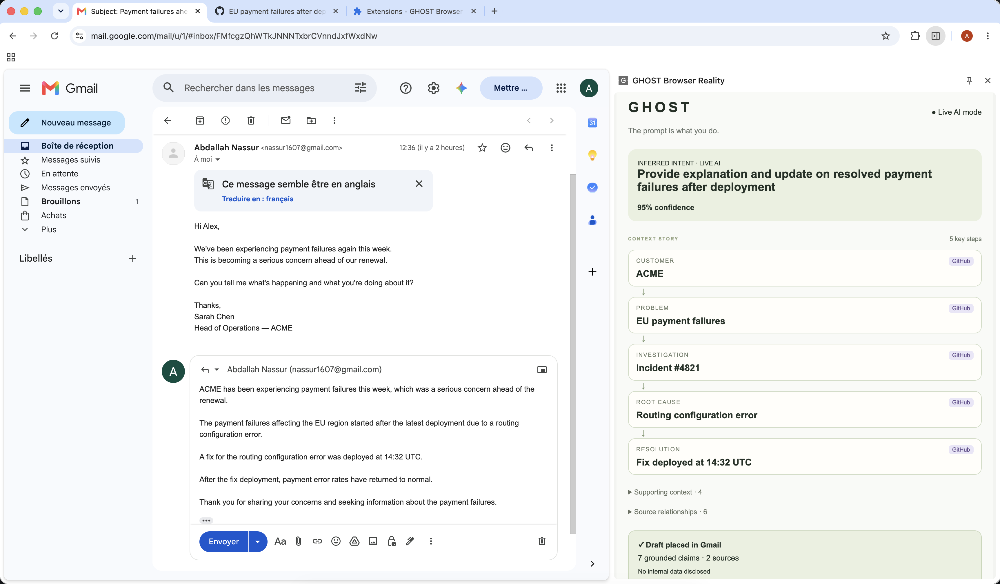

# 👻 GHOST

> **Every app understands what happens inside it. GHOST understands why you move between them.**

GHOST is an ambient browser agent that understands your intent from the way you move through your work.

Instead of stopping to open a chatbot and reconstruct context, you simply work normally. GHOST follows the context you encounter across applications, connects it into a live **Context Story**, and acts when your workflow reaches the right moment.

**The prompt isn't what you type. The prompt is what you do.**



## Demo

A customer reports recurring payment failures in a real Gmail thread. You investigate the incident in a real GitHub repository.

Without being prompted, GHOST connects:

**Customer → Problem → Incident → Root Cause → Resolution**

When you return to Gmail and open **Reply**, GHOST recognizes the transition from investigation to action, generates a grounded response, and automatically places it into the Gmail composer.

**GHOST never sends the email. The user remains in control.**

## How it works

GHOST runs as a **Chrome Manifest V3 extension** with a persistent side panel.

```text
Gmail / GitHub
      ↓
DOM context adapters
      ↓
Cross-app context + provenance
      ↓
OpenAI agent
      ↓
Context Story + inferred intent
      ↓
Grounded action in Gmail
```

The agent processes the work context the user actively visits. Live inference extracts entities, facts, relationships, provenance, and intent from real pages.

Generated replies are grounded against collected evidence, with deterministic privacy boundaries and fallback behavior for reliability.

## Stack

- OpenAI Agents SDK
- Chrome Extension APIs (Manifest V3)
- Next.js + TypeScript
- React + React Flow
- Zod

## Run

Requires Node.js 22+.

```bash
npm ci
cp .env.example .env.local
```

Add your OpenAI API key:

```dotenv
OPENAI_API_KEY=your-key
GHOST_DEMO_MODE=false
```

Then:

```bash
npm run dev
```

Load the unpacked Chrome extension following [`extension/README.md`](extension/README.md).

## Verify

```bash
npm run typecheck
npm run lint
npm test
npm run build
```

## Built at Agents, Everywhere

GHOST was designed and built from scratch during the **Agents, Everywhere** hackathon as a solo project.

The goal: explore an agent that doesn't live in another chatbox, but **between the applications where work already happens**.

---

**The prompt isn't what you type. The prompt is what you do.**